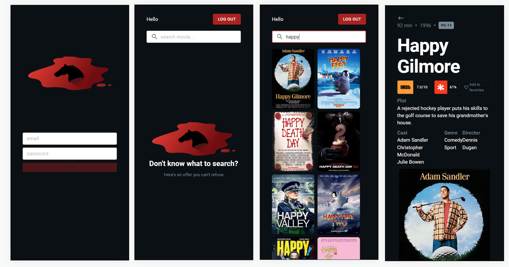
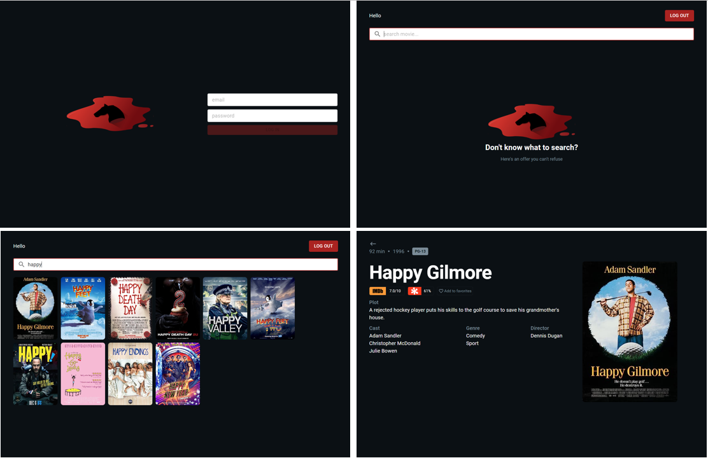
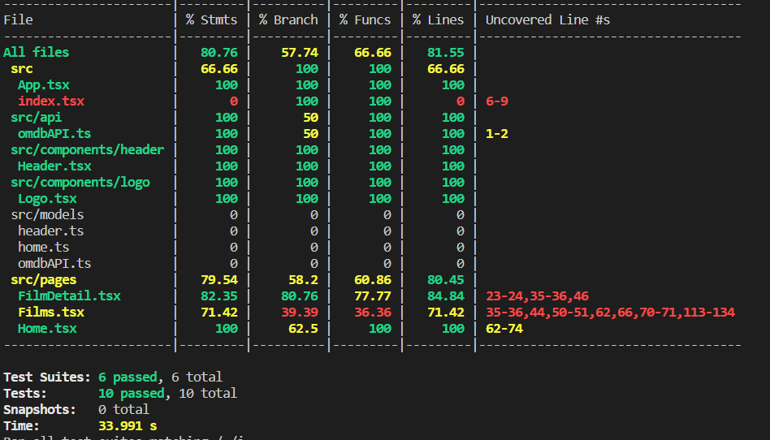

<h1 align="center">Catalogo de Filmes</h1>

Acesse em: [https://jessicamelise.github.io/desafio-catalogo-filmes/#/](https://jessicamelise.github.io/desafio-catalogo-filmes/#/)

A principio o email e password podem ser inseridos qualquer dado para testar a app.

## Índice

* [1. Desafio](#1-desafio)
* [2. Montagem do ambiente de desenvolvimento](#2-montagem-do-ambiente-de-desenvolvimento)
* [3. Implementações Futuras e Melhorias](#3-implementações-futuras-e-melhorias)

## 1. Desafio

O desafio consistem em:

- Utilizar a OMDb API, ou outra API de nossa preferência :heavy_check_mark:
- Home page: Campo de busca e uma listagem de resultados. Pense na página também com os seguintes estados: vazia, com loading e quando um filme não é encontrado :heavy_check_mark:
- Página do filme: Página de detalhes do filme. Pense também nos estados de loading e "filme não encontrado" :heavy_check_mark:
- Não há layout de telas na versão mobile mas se você fizer sua aplicação responsiva será um ponto positivo (desenvolvimento como mobile first) :heavy_check_mark:
- Seja fiel ao layout recebido e fique à vontade para fazer melhorias no layout (melhorias aplicadad: tela de login, header com logout, pipeline, deploy :heavy_check_mark:)
- O projeto conta com muitos pontos de melhorias. Fique a vontade para sugerir. Isso contará pontos no quesito de arquitetura de projeto (sugestão na parte de melhorias desse readme :heavy_check_mark:)
- Há um botão de "like" (coração) no detalhe do filme. Seria legal se essa informação fosse persistida :x:
- Testes unitários contarão como ponto positivo :heavy_check_mark:
- Readme :heavy_check_mark:

Mobile:



Desk:



## 3. Implementações Futuras e Melhorias

* Integração com o firebase para fazer o registro e login persistidos;
* Utilizar o firebase também para setar os filmes favoritos persistidos (antes disso daria para utilizar um json server ou localStorage para armazenar esse dado persistido);
* Aprimorar a listagem que atualmente só vem exibido o limit de 10 itens sem usar a paginação, então seria implemenstar essa paginação e mostrar mais itens que retornaram da request, o endpoint da api utilizada pelo que notei não trabalha com o limite, somente com o total de documentos e a página via query string;
* Melhorar código (quebrar em mais componentes); 
* Melhorar a cobertura de testes;



## 2. Montagem do ambiente de desenvolvimento

> :warning: Será necessária a utilização:

Projeto desenvolvido com React.Js + TypeScript + Material UI

* [Node.js](https://nodejs.org/) que contém o [npm](https://docs.npmjs.com/) para instalação das dependências.

* Faça o clone do projeto:

``` sh
git https://github.com/jessicamelise/desafio-catalogo-filmes.git
```

* Instale as dependências do projeto com o comando:

``` sh
npm install
```

* .env Config

  :warning: Para rodar o projeto local, será necessário um arquivo _**.env**_ na raiz do projeto contendo as informações da url base e apiKey para acessar a API:

``` js
REACT_APP_APIKey={token}
REACT_APP_APIBaseURL={baseUrl}
```

* secrets Config no repositório
  :warning: Caso tenha interesse em manter e evoluir seu projeto clonado, o mesmo tem um workflow configurado no gitlab actions que faz o deploy automático no gh pages e para ele funcionar será necessario setar as secrets abaixo no seu repositório:

``` js
ACTIONS_DEPLOY_ACCESS_TOKEN={token gerado no personal tokens aqui no github}
REACT_APP_APIKEY={token}
REACT_APP_APIBASEURL={baseUrl}
USER_EMAIL={email}
USER_NAME={name}
```

* Localhost:

``` sh
npm start
```

* Testes

```sh
npm run test
```

```sh
npm run test -- --coverage .
```

* Deploy e Build

Está automático pelo workflow do github actions
[https://github.com/jessicamelise/desafio-catalogo-filmes/actions](https://github.com/jessicamelise/desafio-catalogo-filmes/actions)